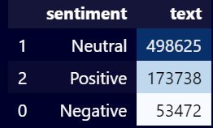
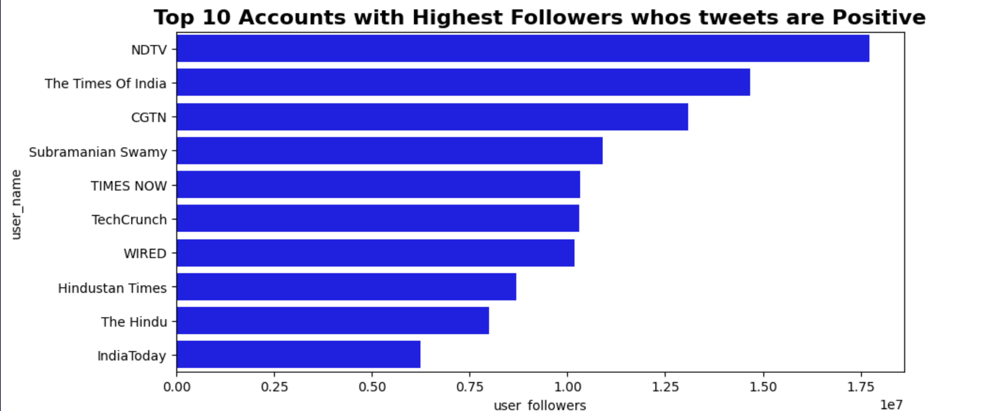
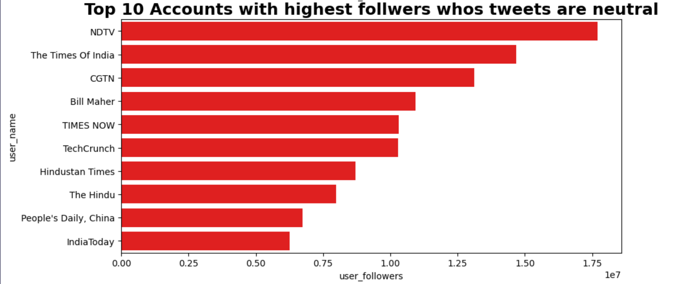
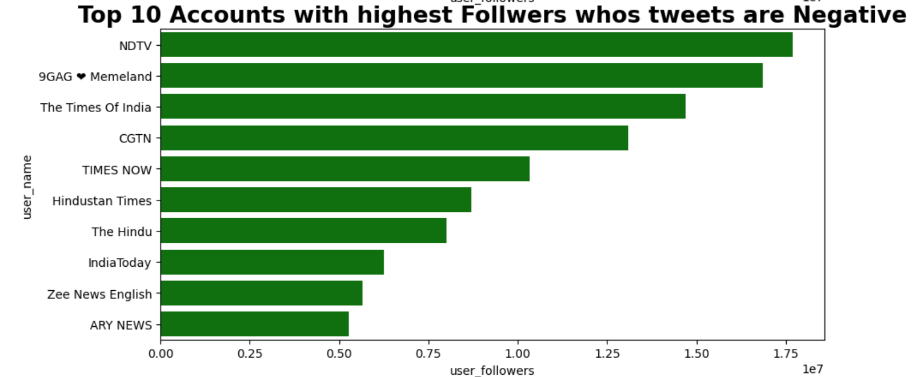
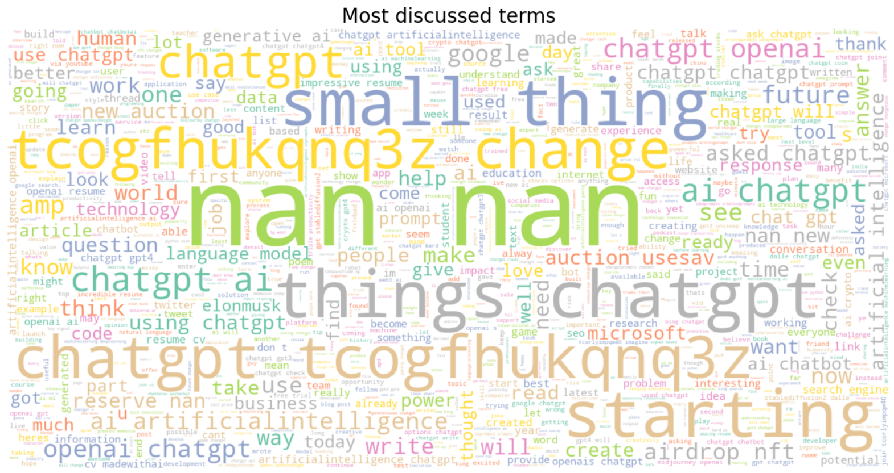

# Tweet Sentiment Analysis 📊🐦

This project focuses on performing sentiment analysis on tweets using the VADER Sentiment Analysis tool and exploring various aspects of the data.

## Table of Contents
1. Introduction
2. Setup ⚙️
3. Data Overview 📋
4. Sentiment Analysis 📈
5. Exploratory Data Analysis (EDA) 📊
6. Visualization 📊
7. Data Cleaning 🧹
8. Conclusion 🎉

## Introduction
This project aims to analyze the sentiment (positive, negative, or neutral) expressed in tweets using the VADER Sentiment Analysis tool. Understanding the sentiment of tweets can provide valuable insights into public opinion, brand perception, and societal trends. The dataset used for analysis includes various attributes such as tweet text, user details, and metadata.

## Setup ⚙️
To replicate the analysis, ensure you have Python 3.x installed on your system. The required Python packages are listed in `requirements.txt`. You can install these dependencies using the following command:

```bash
pip install -r requirements.txt

```

## Data Overview 📋
The dataset (`tweets.csv`) used in this project contains a rich set of attributes including user information (`user_name`, `user_location`, `user_description`), tweet content (`text`, `hashtags`), and metadata (`date`, `source`). The dataset may have missing values, which are handled carefully during the analysis process to ensure robust insights.

## Sentiment Analysis 📈
Sentiment analysis is crucial for understanding the emotional tone behind each tweet. It involves calculating sentiment scores using the VADER Sentiment Analysis tool, which provides a compound score indicating the overall sentiment (positive, negative, or neutral) of each tweet. This analysis helps in categorizing tweets based on their emotional content and understanding trends in public sentiment over time.



## Exploratory Data Analysis (EDA) 📊
Exploratory Data Analysis (EDA) plays a pivotal role in uncovering patterns, trends, and outliers within the dataset. Through EDA, we explore various aspects such as the distribution of sentiment labels across tweets, the geographical distribution of users, common hashtags, and the relationship between user metrics like followers and tweet sentiment.

## Visualization 📊
Visualizations such as bar plots, pie charts, and treemaps are employed to effectively communicate insights derived from the data. These visual representations not only showcase the distribution of sentiments but also highlight significant trends and patterns. Examples include visualizing the distribution of positive, negative, and neutral tweets, as well as depicting user engagement metrics like follower counts in relation to sentiment categories.





## Data Cleaning 🧹
Data cleaning is a critical preprocessing step aimed at ensuring the quality and consistency of data for accurate sentiment analysis. Common cleaning tasks include handling missing values, removing special characters, punctuation, stopwords, and performing text normalization techniques such as stemming and lemmatization. By cleaning the data effectively, we enhance the reliability of sentiment analysis results and improve the overall accuracy of insights drawn from the dataset.

## Conclusion 🎉
In conclusion, this project provides a comprehensive exploration of tweet sentiment analysis using Python and various data analysis libraries. By leveraging sentiment analysis techniques and conducting thorough exploratory analysis, this project offers valuable insights into understanding public sentiment on social media platforms. The findings can be utilized for various applications including brand reputation management, market research, and understanding societal trends.


